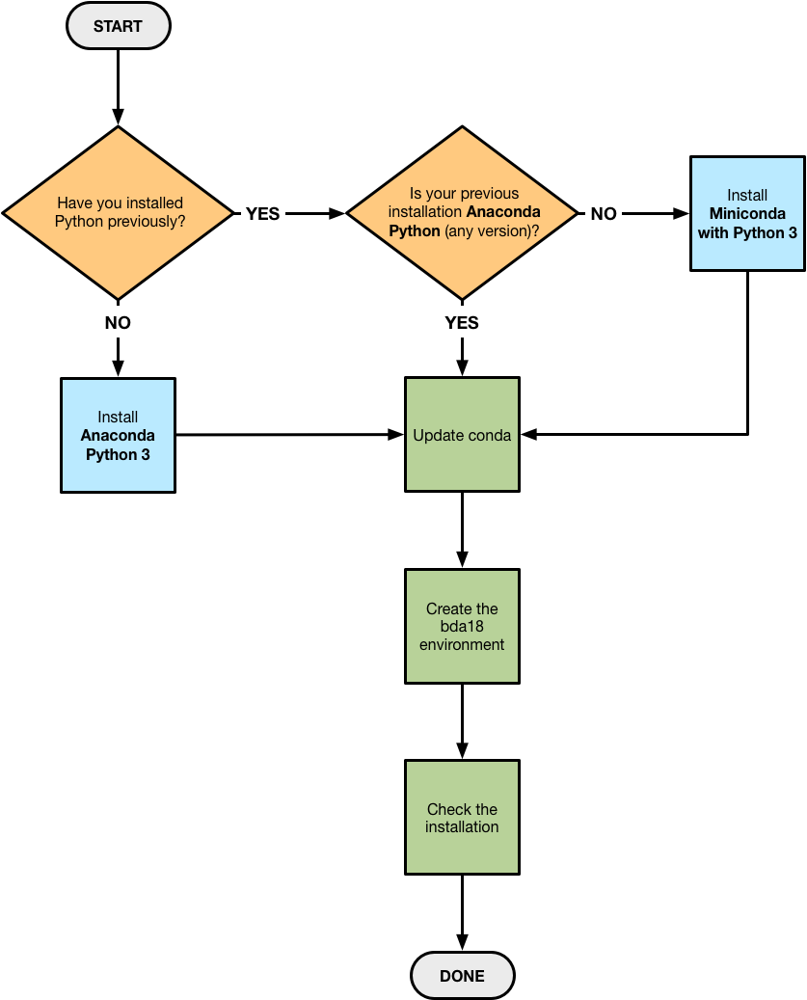

# Python

We will make heavy use of the Python high-level computing language, specifically the CPython-3.6 implementation (usually just called Python-3.6; the "C" indicates it's implemented in the C language). We will also use many Python packages that are not part of Python itself, particularly the collection of packages known colloquially as the **PyData stack** (e.g., packages providing fast numerical computing capability, plotting, and of course statistical computing tools; see [PyData - Downloads](https://pydata.org/downloads.html) for a list).

A **Python distribution** is a software bundle that provides Python along with a curated set of third-party libraries.
If your operating system has Python built in, you probably still want to install a new distribution; please read on.

**Linux and Mac operating systems** come with a version of Python pre-installed, but even on these systems it is highly recommended that one use a separate Python installation for software development. The OS's Python is often several versions out of date, and will not have all the needed packages. Modifying it (by upgrading Python itself, or by updating or adding packages) can be troublesome since some system software may rely on the OS's Python and package versions.

**Windows** does not come with Python, so Windows users will have to install Python.  (If you have installed a Linux environment for Windows, such as Cygwin or MinGW or a Linux virtual machine, you may have Python, but you should still consider installing a separate Python development environment, for the reasons given in the previous paragraph).

You can install a new version of Python by itself, and install and maintain the packages we'll need one by one. It's doable, but quite a headache, and it makes it hard to share code or collaborate on development, since your environment will likely differ from your collaborators' environments.  


## Anaconda Python distribution

I strongly recommend that all BDA students use the **Anaconda Python distribution** (the Python-3.6 version), a distribution specifically assembled to support data science.
It is free, contains most of the software we need, and provides package management and virtual environment capabilities not readily available otherwise, via the included **`conda` package management system**. It supplies compiled binary libraries built with optimized compilers that you may not have easy access to.  It is also very popular.

I will help with installation and operation issues only for Anaconda Python. It requires about 3 GB of disk space for a new installation. It may take a while to download and install everything; budget time for this appropriately.

The [Anaconda Distribution main page](https://www.anaconda.com/distribution/) provides a graphic showing you the data science content included in the distribution, and a prominent link to downloads for Windows, macOS, and Linux.

To set up Anaconda for STSCI 4780, follow the flowchart below. You will have to execute **at most one** of the operations in a blue box. You will have to do **all** of the operations in the green boxes. Details for each operation are provided below.  **Don't execute them all**; rather, follow the flowchart, using the instructions below as needed. (The reason for the various options is to make sure that the Anaconda setup for this class doesn't interfere with any other Python distribution you may need for other work.)

### Anaconda installation flowchart



### Install Anaconda with Python 3

Visit [Downloads | Anaconda](https://www.anaconda.com/download/) to download an installer for your platform. Select the Python-3.6 version. Follow the instructions for your platform, linked here: [Regular Installation — Conda documentation](https://conda.io/docs/user-guide/install/index.html#regular-installation). *Ignore the Miniconda option*; you should install the full Anaconda distribution if the flowchart led you here. As noted in the instructions, if you are asked about settings you aren't sure about, just accept the defaults.

Just follow the first part of those instructions. You may stop when you reach "silent mode" instructions (don't follow those instructions).

**Windows users:** Anaconda installs a Windows program called `Anaconda Prompt`, similar to how the Windows Git installers install `Git Bash`. If you launch `Anaconda Prompt`, you'll get a console/terminal window all set up for accessing Anaconda. (For Linux and macOS users, any terminal session will have access.)


### Install Miniconda with Python 3

This option installs a subset of the full Anaconda distribution, so as not to interfere with other Python content you may have on your computer. You will add further content later, in a protected *conda environment*. I'm not 100% sure this will not affect all other Python installations, but it's likely to work. If you are concerned about this, have a look at: [Installing conda on a system that has other Python installations — Conda documentation](https://conda.io/docs/user-guide/install/index.html#installing-conda-on-a-system-that-has-other-python-installations-or-packages).

* Visit the [Regular Installation documentation](https://conda.io/docs/user-guide/install/index.html#regular-installation), and follow the Miniconda link for your platform.
* Download the installer that includes Python-3.6.
* Follow the remaining instructions. Windows users will launch a standard `.exe` installer. Linx and macOS users will have to run a command-line command to do the installation.


### Update `conda`

A key ingredient of the Anaconda distribution is the **`conda` package management system**.  `conda` is a command-line package manager that can be used to upgrade components of the Anaconda distribution, or to specify specific versions of the components to use. One of its most important capabilities is support of **virtual environments**: collections of packages (Python and/or non-Python packages) that can be tailored to a particular project, and kept isolated from your operating system or the base Anaconda installation. *It's a pretty big deal.*  We'll use it to specify an environment for class assignments.

_**ALL USERS**_ should update the `conda` system, even if you have previously installed Anaconda (in fact, *especially* if you have previously installed it). There are bugs in recent versions of `conda` that have been repaired.  The installer downloads are only updated when many Anaconda packages have been upgraded; the Anaconda team assumes users will immediately update `conda` and they don't update the installers if only `conda` has changed.

To update `conda`:

* Open up a terminal (e.g., Anaconda Prompt, Terminal, or an xterm).
* This is probably unnecessary, but recommended for Windows and macOS users: In the terminal, navigate to your Anaconda installation directory.  If you accepted the default settings, this will be a directory named `anaconda` in your home directory.
* Simply run `conda update conda`.  Accept any changes it offers to make.


### Create the bda18 environment

This step is necessary for users who had to install Miniconda. Users who installed the full Anaconda distribution will probably have no problem working the default (base) environment, at least for the first half of the course.  But the safest way to work is to compartmentalize work for this course using a `conda` environment, so I recommend that **all users** do this step.

In a terminal session (you need not be in any specific location), enter this command (it may take a while to finish, especially if you installed Miniconda instead of the full Anaconda):

```
conda create -n bda18 python=3.6 anaconda
```

This creates an environment named `bda18` that has access to the full Anaconda distribution using Python-3.6.  Later, we'll be adding other packages to this environment.  By working in an environment, we can make sure that any changes we make don't impact any other Python work you may do.

_**NOTE THE FOLLOWING:**_ You will need to activate the `bda18` environment every time you do work for the course (including when you launch Jupyter notebooks). So memorize the instructions below (but don't execute them right now).

FYI: Activation runs a shell script that changes environment variables in the current shell.  This will sometimes display a lot of environment variable values on your terminal; this is fine (as long as there are no errors).

**To activate the environment:**

*  On macOS and Linux, in your Terminal Window, use the shell's `source` command (which runs a script in the current shell session); type:
  ```
  source activate bda18
  ```
* On Windows, in Anaconda Prompt, run:
  ```
  activate bda18
  ```

**To deactivate the environment:**

* On macOS and Linux, in your Terminal Window, run:
  `source deactivate`
* On Windows, in Anaconda Prompt, run:
  `deactivate`

Activating an environment *only affects the current terminal session in which you entered the command*. You probably won't need to deactivate `bda18` often (if at all). When you close your terminal or Anaconda Prompt session, the environment settings will be forgotten.


### Check the installation

Check that three key components work:

* Launch a terminal and activate `bda18`.
* Run the **Python interpreter** by typing `python` and hitting `return`. It should type out a line or two of info identifying itself as Python 3.6.x  (for some "x"); it will also likely identify itself as being part of Anaconda.  It will show the Python prompt:  `>>>`. At this point, you can type `Ctl-D` to quit—or play with Python if you wish.
* Run the **IPython interpreter**. This is a souped-up Python interpreter.  Type `ipython` and hit `return`. This time the message will identify the IPython version (5.x.y) and the Python version, and end with the IPython prompt, `In [1]:`.  As with Python, `Ctl-D` quits (though it may prompt to verify you want to quit).
* Finally, check that the **Jupyter notebook** system works.  Type `jupyter notebook` and hit `return`.  This should open a tab in your default web browser—the notebook works in a web browser. You may then quit Jupyter notebook in two steps:  Close the browser tab, and then back in the terminal session, type `Ctl-C` and verify you want to end the Jupyter session.

If all of that works, you should be ready to go for Python- and Jupyter-based assignments.
